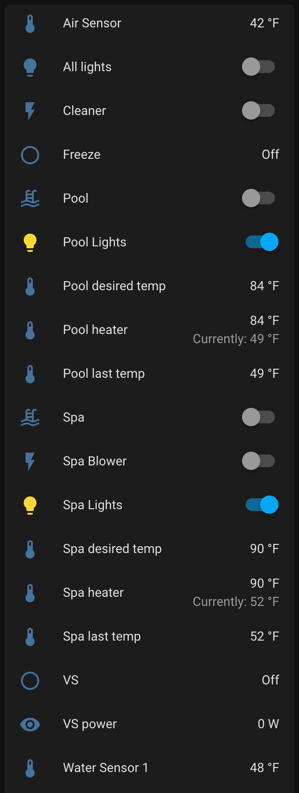

# Pentair Intellicenter for Home Assistant

[![hacs][hacsbadge]][hacs]
[![GitHub Release][releases-shield]][releases]

## Installation

### From HACS

1. Install HACS if you haven't already (see [installation guide](https://hacs.netlify.com/docs/installation/manual)).
2. Add custom repository `https://github.com/jlvaillant/intellicenter` as "Integration" in the settings tab of HACS.
3. Find and install "Pentair Intellicenter" integration in HACS's "Integrations" tab.
4. Restart your Home Assistant.
5. 'Pentair Intellicenter' should appear thru discovery in your Home Assistant Integration's page

### Features

- Connect to a Pentair Intellicenter thru the local (network) interface
- supports Zeroconf discovery
- reconnects itself grafecully in the Intellicenter reboots and/or gets disconnected
- "Local push" makes system very responsive

### Entities created

- for each body of water (like Pool and Spa) it creates:
    - a switch to turn the body on and off
    - a sensor for the last temperature
    - a sensor for the desired temperature
    - a water heater (if applicable):
        - set to ON to enable that heater, set to OFF otherwise
        - status is 'OFF', 'IDLE' (if heater is enabled but NOT running) or
          'HEATING' is the heater is currently running
- creates a switch for all circuits marked as "Featured" on the IntelliCenter
  (for example "Cleaner" or "Spa Blower)
- for each light (and light show) it creates a Light entity
  Note that color effects are only implemented for IntelliBrite lights
- for each pump, a binary_sensor is created
  if the pump supports it, a sensor will reflect how much power the pump uses
- a binary_sensor will indicate if the system is in Freeze prevention mode
- sensors will be created for each sensor in the system (like Water and Air)
  Note that a Solar sensor might also be present even if (like in my case) its value
  is not relevant

### Examples

### Caveats

- the use of a password on the IntelliCenter is NOT supported
- schedules are not reflected in HomeAssistant (though they keep running)
- while I tried to make the code as generic as possible I could only test using
  my own pool configuration. In particular, I do not have covers, chemistry, cascades,
  solar heater, etc... These may work out of the box or not...

[hacs]: https://github.com/custom-components/hacs
[hacsbadge]: https://img.shields.io/badge/HACS-Custom-orange
[releases-shield]: https://img.shields.io/github/v/release/jlvaillant/intellicenter
[releases]: https://github.com/jlvaillant/intellicenter/releases
